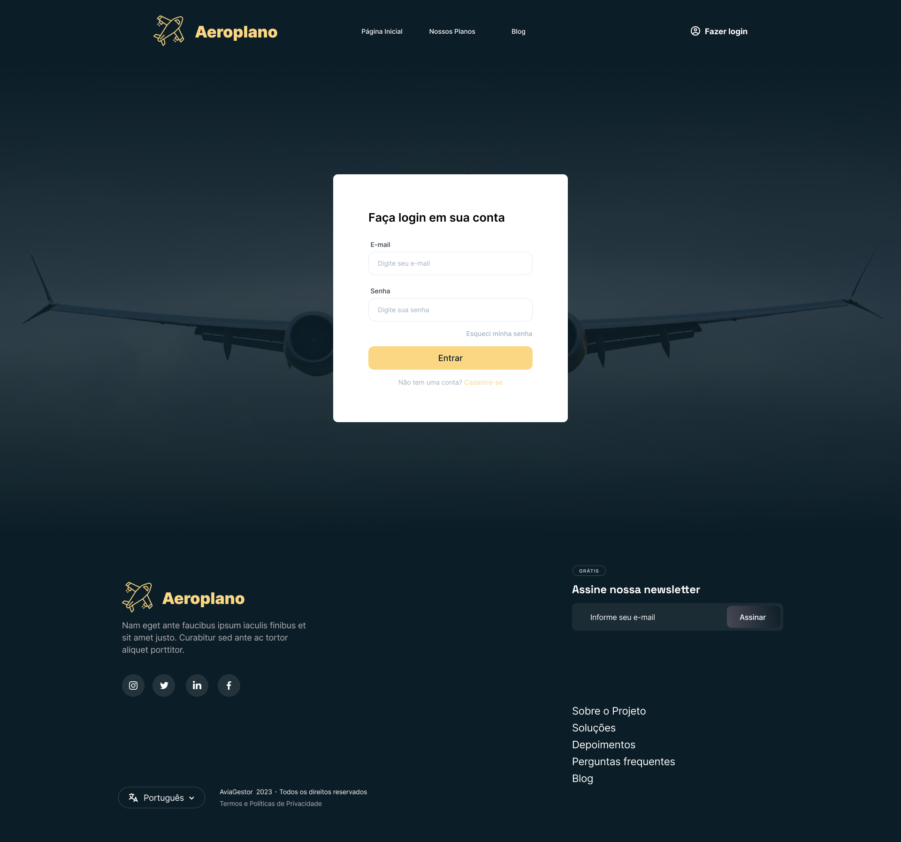
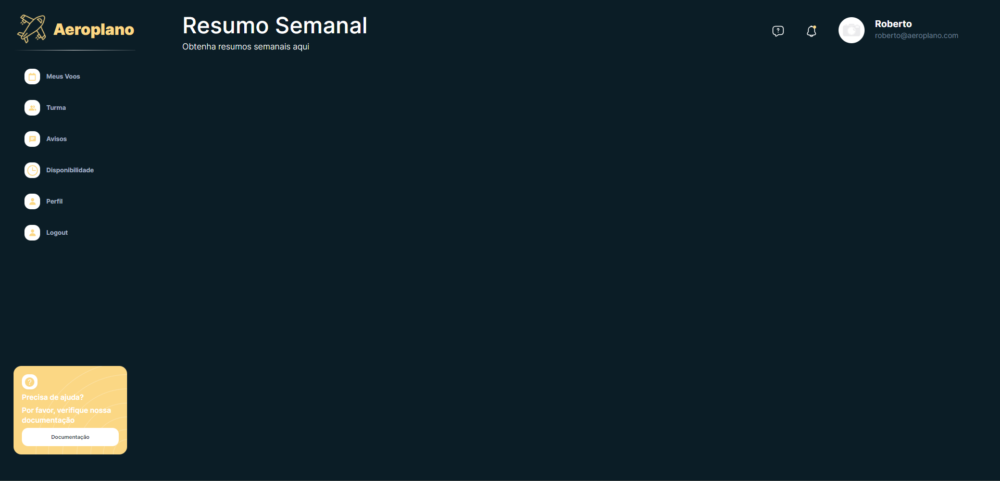
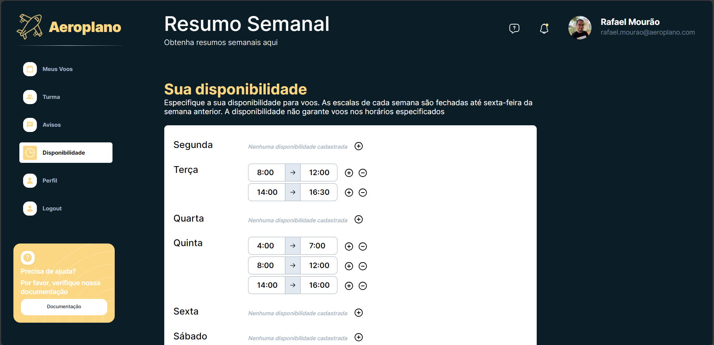

# Programação de Funcionalidades

### Landing Page

Responsável: José Antônio, Rafael Mourão

Requisito atendido: RF-15: Deve ter uma landing page que possibilite usuários não logados conhecer o projeto

Exemplo da tela Landing Page


#### Artefatos da funcionalidade

- index.html
- header.html
- footer.html
- index.js
- main.js
- header.js
- footer.js
- main.min.css
- header.min.css
- footer.min.css

### Tela de Login

Responsável: Rafael Mourão

O botão de login está claramente visível no cabeçalho de todas as páginas, e não é necessário que o usuário esteja autenticado no sistema para utilizá-lo. As estruturas de dados foram desenvolvidas com base em HTML, CSS e JavaScript.

Requistio atendido: RF-16: Usuários cadastrados devem ser capazes de acessar a área restrita

Exemplo da tela de login: 



#### Artefatos da funcionalidade


- login.html 
- login.min.css
- main.min.css
- header.min.css
- footer.min.css
- acesso.min.css
- login.js
- main.js


#### Instruções de acesso

Abra um navegador de Internet e informe a seguinte URL: https://aeroplano.vercel.app/

Ao clicar no botão "Entrar" localizado no canto superior direito da tela, você será direcionado para a página de login.

Nota: Temporariamente, não é possivel cadastrar novos usuários pelo front-end. Os seguintes usuários já foram cadastrados e podem ser utilizados:

| Login | Senha |
| --- | --- |
| roberto@aeroplano.com | 123456789 |
| cesar@aeroplano.com | 12344678 |
| rafael.mourao@aeroplano.com | Password1! |

#### Estrutura de Dados

Os dados dos usuários foram manualmente inseridos no arquivo JSON (codigo-fonte/assets/bd/users.json) e seguem o padrão abaixo:

```
{
   "id": 2,
    "name": "Rafael Mourão",
    "email": "rafael.mourao@aeroplano.com",
    "password": "Password1!",
    "gender": "M",
    "birthDate": "15/11/1990",
    "canac": 12346,
    "cma": {
      "type": 2,
      "expireDate": "20/10/2024"
    },
    "certificates": {},
    "lastSeen": null,
    "lastAccess": null,
    "onlineStatus": false,
    "school": [
      {
        "id": 0,
        "registerNumber": 12,
        "role": "student"
      }
    ],
    "metadata": {
      "avatar": "./assets/image/user_rafael.jpeg"
    },
     "availability": {
      "counter": 5,
      "details": {
        "monday": [],
        "tuesday": [
          [8, 12],
          [14, 16.5]
        ],
        "wednesday": [],
        "thursday": [
          [4, 7],
          [8, 12],
          [14, 16]
        ],
        "friday": [],
        "saturday": [],
        "sunday": []
      }
    }
  }
```

### Dashboard

Responsável: Rafael Mourão

Requistio atendido: RF-17: Na área restrita, deve haver um layout padrão de dashboard compartilhado por todas telas

Exemplo da tela de dashboard:



#### Artefatos da funcionalidade

-	dashboard.html 
-	dashboard.min.css
-	dashboard.js

### Tela de Disponibilidade

Responsável: Rafael Mourão

Requistio atendido: RF-02: Cadastro de disponibilidade do aluno/instrutor

Exemplo da tela de disponibilidade: 




#### Artefatos da funcionalidade

- disponibilidade.html
- disponibilidade.js
- disponibilidade.min.cs

#### Instruções de acesso

Abra um navegador de Internet e informe a seguinte URL: https://aeroplano.vercel.app/dashboard.html

Ao clicar no botão "Disponibilidade" localizado no menu lateral esquerdo da tela, você será direcionado para a página de disponibilidade.

#### Estrutura de dados

Após o login, a disponibilidade previamente salva pelo usuário é carregada no Local Storage, juntamente com os demais dados do usuário.
A cada ação do usuário nessa tela (adicionar janela de disponibilidade, remover janela, modificar horários), as mudanças são salvas no Session Storage temporariamente. Ao selecionar "Salvar" as modificações são então salvas no Local Storage novamente.

A estrutura de dados dessa tela é a seguinte:

```
{ 
     "availability": {
      "counter": 5,
      "details": {
        "monday": [],
        "tuesday": [
          [8, 12],
          [14, 16.5]
        ],
        "wednesday": [],
        "thursday": [
          [4, 7],
          [8, 12],
          [14, 16]
        ],
        "friday": [],
        "saturday": [],
        "sunday": []
      }
    }
  }
```
